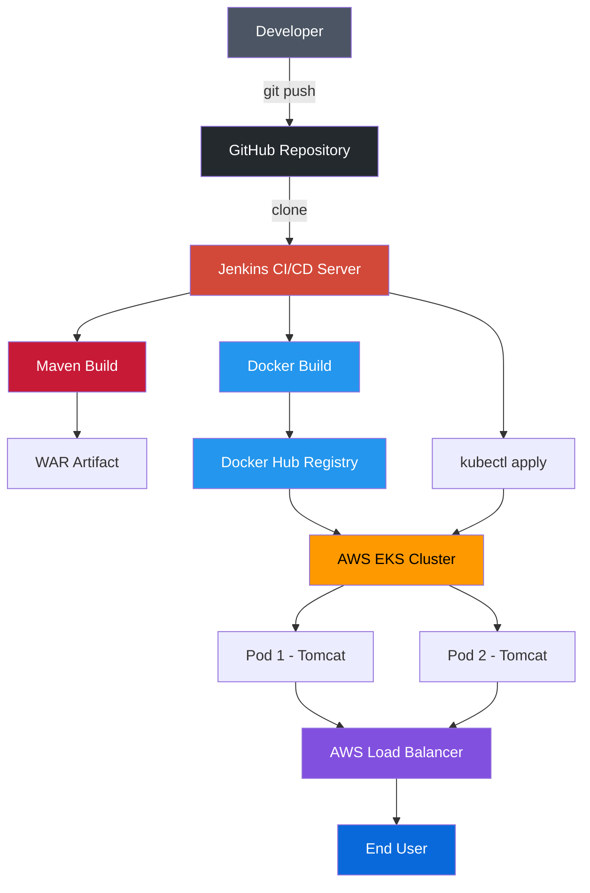

<div align="center">

# 🚀 End-to-End DevOps CI/CD Pipeline

### Automated Java Web Application Delivery with Jenkins, Maven, Docker, Kubernetes & AWS EKS

[](https://www.jenkins.io/)
[](https://maven.apache.org/)
[](https://www.docker.com/)
[](https://kubernetes.io/)
[](https://aws.amazon.com/eks/)
[]()
[]()

**A production-style, fully automated CI/CD pipeline that takes a Java web application from a Git commit to a live, load-balanced deployment on AWS EKS — with zero manual intervention.**

[Overview](#-project-overview) •
[Architecture](#️-architecture) •
[Tech Stack](#️-tech-stack) •
[Pipeline](#-cicd-workflow) •
[Setup](#-getting-started) •
[Verification](#-verification--testing) •
[Troubleshooting](#️-troubleshooting-log) •
[Learnings](#-key-learning-outcomes)

</div>

---

## 📌 Project Overview

This project implements a complete, real-world **CI/CD pipeline** for a Java web application — covering everything from source control to a running, internet-facing service on Kubernetes.

Every stage of the software delivery lifecycle is automated:

```
GitHub → Jenkins → Maven → Docker → Docker Hub → Kubernetes → AWS EKS → Load Balancer → Live App
```

**Why this matters:** manual deployment is slow, error-prone, and doesn't scale. This pipeline removes human intervention from the build-test-package-deploy cycle, so every code push can safely and consistently become a production deployment.

### 🎯 Objectives

| Goal | How it's achieved |
|---|---|
| Version-controlled source code | GitHub as the single source of truth |
| Automated builds on every push | Jenkins pipeline triggers |
| Reliable, repeatable packaging | Maven build lifecycle |
| Environment-agnostic deployment | Docker containerization |
| Centralized image distribution | Docker Hub registry |
| Self-healing, scalable runtime | Kubernetes Deployments |
| Managed, production-grade infrastructure | AWS EKS |
| Secure external access | AWS Load Balancer |

---

## 🏗️ Architecture

<div align="center">



</div>

---

## 🔄 CI/CD Workflow

| Stage | Action | Tool |
|:---:|---|:---:|
| 1 | Developer pushes code | Git |
| 2 | Source code is stored | GitHub |
| 3 | Repository is cloned | Jenkins |
| 4 | Application is compiled & packaged | Maven |
| 5 | WAR artifact is generated | Maven |
| 6 | Container image is built | Docker |
| 7 | Image is pushed to registry | Docker Hub |
| 8 | Manifests are applied to cluster | kubectl |
| 9 | Pods are scheduled & started | Kubernetes |
| 10 | Service is exposed externally | AWS Load Balancer |
| 11 | User accesses the live application | Browser |

---

## 🛠️ Tech Stack

<div align="center">

| Category | Technologies |
|---|---|
| **Language & Build** | ☕ Java · 📦 Maven |
| **Source Control** | 🐙 GitHub |
| **CI/CD** | 🔨 Jenkins |
| **Containerization** | 🐳 Docker · 🐳 Docker Hub |
| **Orchestration** | ☸️ Kubernetes |
| **Cloud & Infra** | ☁️ AWS EKS · 🔐 AWS IAM · ⚖️ AWS Load Balancer |
| **Runtime** | 🐱 Apache Tomcat |
| **OS / Admin** | 🐧 Ubuntu Linux |

</div>

---

## 📂 Project Structure

```text
maven-web-app/
├── src/
│   └── main/
│       └── webapp/            # Application source
├── target/
│   └── maven-web-app.war      # Build output
├── Dockerfile                 # Container image definition
├── k8s-deploy.yml             # Kubernetes manifests
├── pom.xml                    # Maven project config
├── Jenkinsfile                # CI/CD pipeline definition
└── README.md
```

---

## ⚙️ Component Deep Dive

### 1️⃣ GitHub — Source Control

Repository:
```text
https://github.com/Saf1111/maven-web-app.git
```
Jenkins pulls the latest source directly from this repository at the start of every pipeline run.

### 2️⃣ Jenkins — CI/CD Orchestration

Jenkins drives the entire pipeline through five sequential stages:

```text
Clone → Build → Dockerize → Push → Deploy
```

### 3️⃣ Maven — Build & Package

```bash
mvn clean package
```
Produces `target/maven-web-app.war`, the deployable artifact consumed by the Docker build stage.

### 4️⃣ Docker — Containerization

```bash
docker build -t safwan112/mavenwebapp:latest .
```
Packages the WAR file into a Tomcat-based image:
```text
Docker Image
└── Apache Tomcat
    └── maven-web-app.war
```

### 5️⃣ Docker Hub — Image Registry

```bash
docker push safwan112/mavenwebapp:latest
```
Image path: `safwan112/mavenwebapp:latest`

### 6️⃣ Kubernetes — Orchestration

| Setting | Value |
|---|---|
| Replicas | `2` |
| Container Port | `8080` |
| Service Type | `LoadBalancer` |

### 7️⃣ AWS EKS — Managed Kubernetes

The cluster runs across multiple worker nodes, each capable of scheduling application pods, giving the deployment high availability out of the box.

### 8️⃣ AWS IAM — Secure Access

EC2 nodes assume the `eksroleec2` IAM role, allowing them to interact with AWS services without hardcoded credentials.

---

## 🔐 Secrets Management

Docker Hub credentials are never hardcoded. Jenkins injects them at runtime via the Credentials store:

```groovy
withCredentials([usernamePassword(
    credentialsId: 'dockerhub',
    usernameVariable: 'DOCKER_USERNAME',
    passwordVariable: 'DOCKER_PASSWORD'
)])
```

---

## 📜 Jenkinsfile

```groovy
pipeline {
    agent any

    tools {
        maven "Maven"
    }

    stages {

        stage('Clone Repo') {
            steps {
                git 'https://github.com/Saf1111/maven-web-app.git'
            }
        }

        stage('Maven Build') {
            steps {
                sh 'mvn clean package'
            }
        }

        stage('Docker Build') {
            steps {
                sh 'docker build -t safwan112/mavenwebapp:latest .'
            }
        }

        stage('Docker Push') {
            steps {
                withCredentials([usernamePassword(
                    credentialsId: 'dockerhub',
                    usernameVariable: 'DOCKER_USERNAME',
                    passwordVariable: 'DOCKER_PASSWORD'
                )]) {
                    sh '''
                        echo "$DOCKER_PASSWORD" | docker login \
                        -u "$DOCKER_USERNAME" --password-stdin

                        docker push safwan112/mavenwebapp:latest

                        docker logout
                    '''
                }
            }
        }

        stage('K8s Deploy') {
            steps {
                sh 'kubectl apply -f k8s-deploy.yml'
            }
        }
    }
}
```

---

## 🚦 Getting Started

### Prerequisites
- An AWS account with an active **EKS cluster** and configured `kubectl` context
- A **Jenkins** server with Maven, Docker, and `kubectl` installed/configured
- A **Docker Hub** account with a Jenkins credential (`dockerhub`) set up
- Java + Maven installed on the Jenkins agent

### Steps

1. **Fork / clone** this repository
   ```bash
   git clone https://github.com/Saf1111/maven-web-app.git
   ```
2. **Create a Jenkins pipeline job** pointing at this repo's `Jenkinsfile`
3. **Add Docker Hub credentials** in Jenkins as `dockerhub` (usernamePassword type)
4. **Update image names** in `Dockerfile`, `Jenkinsfile`, and `k8s-deploy.yml` to your own Docker Hub namespace
5. **Trigger the pipeline** — Jenkins will build, containerize, push, and deploy automatically
6. **Retrieve the Load Balancer URL** (see [Verification](#-verification--testing) below) and open it in your browser

---

## 🧪 Verification & Testing

**Check cluster nodes**
```bash
kubectl get nodes
```
```text
NAME                             STATUS
ip-xxx-xxx-xxx-xxx.ec2.internal  Ready
ip-xxx-xxx-xxx-xxx.ec2.internal  Ready
```

**Check pods**
```bash
kubectl get pods
```
```text
NAME                                READY   STATUS
mavenwebappdeployment-xxxxx-xxxxx   1/1     Running
mavenwebappdeployment-xxxxx-xxxxx   1/1     Running
```

**Check deployment**
```bash
kubectl get deployment
```

**Check service & external endpoint**
```bash
kubectl get svc
```
```text
NAME             TYPE           EXTERNAL-IP
mavenwebappsvc   LoadBalancer   <AWS-LOAD-BALANCER-DNS>
```

**Confirm deployed image**
```bash
kubectl get deployment mavenwebappdeployment \
  -o jsonpath='{.spec.template.spec.containers[*].image}'
```
```text
safwan112/mavenwebapp:latest
```

**Access the application**

Since the artifact is `maven-web-app.war`, Tomcat serves it at the `/maven-web-app/` context path:

```text
http://<LOAD-BALANCER-DNS>/maven-web-app/
```

---

## 🛠️ Troubleshooting Log

> Real issue encountered and resolved during deployment — kept here as a reference for common failure modes.

**Symptom:** Pods stuck in `ErrImagePull`

**Diagnosis:**
```bash
kubectl describe pod <pod-name>
```
revealed Kubernetes was attempting to pull an incorrect image (`vinodses/mavenwebapp`) instead of the correct one (`safwan112/mavenwebapp:latest`).

**Fix:**
```bash
kubectl set image deployment/mavenwebappdeployment \
  mavenwebappcontainer=safwan112/mavenwebapp:latest
```

**Result:** Both pods transitioned to `Running` within seconds.

| Symptom | Likely Cause | Fix |
|---|---|---|
| `ErrImagePull` / `ImagePullBackOff` | Wrong image name/tag, private repo without pull secret | Verify image path; add `imagePullSecrets` if private |
| `CrashLoopBackOff` | App fails on startup | `kubectl logs <pod>` to inspect stack trace |
| Service has no `EXTERNAL-IP` | LoadBalancer provisioning delay or missing IAM permissions | Wait, then check AWS console / IAM role |
| Jenkins Docker push fails | Expired/incorrect credentials | Rotate token, re-check Jenkins Credential ID |

---

## 📚 DevOps Concepts Demonstrated

<table>
<tr>
<td valign="top" width="33%">

**Source Control**
- Git fundamentals
- GitHub repository management
- Branching & cloning

</td>
<td valign="top" width="33%">

**CI Automation**
- Jenkins pipelines (declarative)
- Automated Maven builds
- Credential management

</td>
<td valign="top" width="33%">

**Containerization**
- Dockerfile authoring
- Image build/tag/push
- Docker Hub registry workflows

</td>
</tr>
<tr>
<td valign="top" width="33%">

**Orchestration**
- Kubernetes Deployments & Pods
- Services & LoadBalancer exposure
- Replica management

</td>
<td valign="top" width="33%">

**Cloud Infrastructure**
- AWS EKS cluster operations
- IAM roles for EC2
- AWS Load Balancer provisioning

</td>
<td valign="top" width="33%">

**Operations**
- Linux/Ubuntu administration
- Production troubleshooting
- Deployment verification

</td>
</tr>
</table>

---

## 💡 Key Learning Outcomes

Through building this pipeline end-to-end, I gained hands-on experience:

- ✅ Building and packaging Java applications with Maven
- ✅ Managing source code and collaboration through GitHub
- ✅ Designing and running declarative Jenkins pipelines
- ✅ Writing Dockerfiles and managing container images
- ✅ Publishing and versioning images on Docker Hub
- ✅ Writing Kubernetes Deployment and Service manifests
- ✅ Operating a managed Kubernetes cluster on AWS EKS
- ✅ Configuring IAM roles for secure, keyless AWS access
- ✅ Exposing containerized applications via LoadBalancer services
- ✅ Diagnosing and resolving real Kubernetes deployment failures

---

## ⭐ Highlights

- 🔄 Fully automated, zero-touch CI/CD pipeline
- 🐳 Immutable, portable container builds
- ☸️ Self-healing, horizontally scalable Kubernetes deployment
- ☁️ Production-grade managed infrastructure on AWS EKS
- 🔐 Credential-free, IAM-based AWS authentication
- 🛠️ Documented real-world troubleshooting and resolution

---

## 📌 Conclusion

This project shows how independent DevOps tools — source control, CI, containerization, and orchestration — combine into a single, reliable delivery pipeline. Instead of manually building and deploying, every push to GitHub can flow automatically through Jenkins, Maven, and Docker, and land safely on a scalable Kubernetes cluster running on AWS EKS.

```text
GitHub + Jenkins + Maven + Docker + Docker Hub + Kubernetes + AWS EKS + Load Balancer
                                    =
                    Complete End-to-End CI/CD Pipeline
```

---

<div align="center">

### ⭐ If this project helped you, consider giving it a star!

</div>
